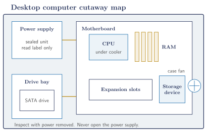
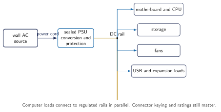
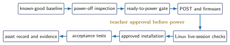
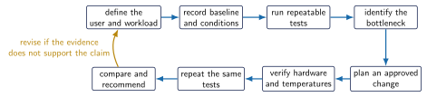

# Basic Computer Systems {.course-day-slide}

Three current missions, then a commissioned, upgraded, benchmarked classroom workstation

# Main Quest Route

1. CS01 Electricity-to-computer bridge
2. CS02 Parts, baseline, ESD, and safe opening
3. CS03 Power and connections
4. CS04 Ready-to-power gate and first boot
5. CS05 POST and BIOS/UEFI
6. CS06 Teacher-selected Linux commissioning
7. CS07 RAM upgrade
8. CS08 Build-the-best-computer challenge

# Hardware Safety Boundary

::: {.important}
Never open or probe inside a power supply.
:::

- Shut down and unplug before changing hardware.
- Students never create shorts or invent faults.
- The teacher prepares every fault station.
- Stop for damage, liquid, swollen cells, burnt areas, smoke, unusual smell, abnormal heat, or unexpected noise.

# Current Classroom Order

1. Every student completes Power Circuits Questions 1-6.
2. The Computer Power and Parts lab remains a teacher-planning shell until the actual classroom computer and safe measurement method are documented.
3. Early finishers may choose Make It Print.
4. One limited pair completes the Computer Recovery and OS Comparison.
5. After Thanksgiving, the whole class begins CS01-CS08 with the selected OS.

Pilot work does not complete the formal sequence early.

# Make It Print

**3D Printing Side Quest**

- Power Circuits Questions 1-6 complete
- teacher approval
- printer available
- existing teacher-approved model

## Make It Print Workflow

1. Obtain the printer login from your teacher.
2. Confirm model, printer, scale, orientation, material, and estimated time.
3. Show the sliced preview and obtain approval.
4. Observe the first layer.
5. Stop and notify the teacher for any unsafe or unexpected condition.
6. Cool, remove only when approved, clean, and document.

# Computer Recovery and OS Comparison

Select two closely matched computers and use identical USB models, the same port type, waiting period, and test procedure.

| Round | Computer A | Computer B |
|:--|:--|:--|
| 1 | Xubuntu live | Mint Xfce live |
| 2 | Mint Xfce live | Xubuntu live |

Live-USB boot time is not a fair performance benchmark.

## Comparison Measures

Use **Pass / Concern / Fail** for:

- display, keyboard, mouse, and cursor stability
- USB, Ethernet, Wi-Fi, and sound
- internal-storage visibility

Compare idle memory, browser launch, Tinkercad, Inkscape, VS Code, settings clarity, and update experience.

Reserve Green, Yellow, and Red for final machine classification.

## Pilot Approval Gates

| Gate | Teacher signature required before |
|:--|:--|
| ready to power | first power after opening |
| hardware work | moving RAM or replacing storage |
| data action | erasing or partitioning a drive |
| installation | installing the teacher-selected OS |

Student success uses safe evidence, reasoning, and following the gates. The machine does not need to work.

## PC and Intel Mac Startup Keys

| Machine | Key | Purpose |
|:--|:--|:--|
| PC | F2 or Delete | firmware setup |
| PC | F12 | boot selection, when supported |
| Intel Mac | Option or Alt | Startup Manager |
| Intel Mac | D or Option-D | Apple Diagnostics |
| Intel Mac | Command-R | Recovery |
| Intel Mac | Option-Command-R | Internet Recovery |

Use a wired keyboard. Intel Macs use EFI or UEFI firmware rather than an ordinary PC BIOS.

::: {.notes}
Official Apple sources: https://support.apple.com/102603 and https://support.apple.com/102550
:::

## Teacher OS Decision

- Xubuntu as the classroom standard
- Mint Xfce as the classroom standard
- Lubuntu for weak machines
- additional testing required

The current Xubuntu choice is provisional until this comparison is complete.

# Computer Power and Parts

**Future lab shell**

The teacher will add photographs of the actual classroom computer and exterior PSU label, an approved measurement method, and cited values before this becomes a student assignment.

Never open the PSU or probe energized internal circuits.

## Six Questions

1. Label evidence on the actual computer and nameplate photographs.
2. Calculate branch power from approved values.
3. Calculate branch current from approved values.
4. Calculate equivalent resistance.
5. Add cited branch powers to find $P_{\mathrm{T}}$.
6. Compare teacher-approved wall-input data with the PSU rating.

Each GUESS step has its own row. Question 5 keeps the branch variables in separate columns.

# CS01 Computer Cutaway

{width=94%}

## Two System Views

| Powered circuit | Information system |
|:--|:--|
| source and conversion | input |
| conductors and distribution | processing |
| protection and controls | memory and storage |
| parallel loads | output and communication |

The same part can appear in both views.

## Power Button as an Input

The front-panel button usually sends a control signal to motherboard logic.

It does not directly carry the total computer load current.

Connect this idea to the active-low switch and pull-up circuits from D01.

# CS02 Known-Good Baseline

Record before opening:

| Identity | Operation | Condition |
|:--|:--|:--|
| asset and model | display and startup | visible damage |
| installed system | sound and ports | unusual smell or noise |

A baseline separates an existing problem from a change introduced during service.

## ESD and Electric Shock

| Hazard | Main concern | Control |
|:--|:--|:--|
| electrostatic discharge | component damage | approved ESD work area and handling |
| electrical shock | harm to a person | power removal and sealed PSU boundary |

Static energy can damage a device even when you feel nothing.

## Safe Opening Sequence

1. Record the powered baseline.
2. Shut down through the operating system.
3. Unplug power and peripherals.
4. Move to the approved ESD area.
5. Photograph cable locations and the closed case.
6. Open only the directed chassis panel.
7. Handle parts by their edges.

# CS03 Computer Power

{width=96%}

## PSU Nameplate

Read the label from outside the sealed enclosure.

Record:

- rated input
- rated DC outputs
- maximum combined power
- model and certification markings

A wattage rating states capacity under specified conditions. It does not measure present use.

## GUESS Power Example

Given $V=12.0\ \mathrm{V}$ and $I=3.25\ \mathrm{A}$

Unknown $P$ in watts

$$P=VI$$

$$P=(12.0\ \mathrm{V})(3.25\ \mathrm{A})=39.00000\ \mathrm{W}$$

Final result: $39.0\ \mathrm{W}$ to three significant figures

## Power and Data Paths

Trace both paths without disconnecting anything.

| Path | Example |
|:--|:--|
| power | PSU to SATA power to storage |
| data | storage to motherboard SATA or NVMe interface |

Never force a keyed connector or rely on wire colour alone.

# CS04 Ready-to-Power Gate

The gate checks:

- no loose metal or tools
- RAM and approved cards fully seated
- connectors aligned and latched
- cooler and fans secure
- cables clear of fans
- chassis stable
- external display and keyboard connected
- teacher approval

## Commissioning Flow

{width=100%}

## First-Boot Prediction

Predict before power:

| Evidence | Prediction | Observation |
|:--|:--|:--|
| power indicator | | |
| fan movement | | |
| display message | | |
| startup sound | | |

Stop for smoke, smell, unusual noise, blocked fans, repeated cycling, or abnormal heat.

# CS05 Startup Sequence

1. Power command
2. Stable rails
3. Firmware begins
4. POST checks essential hardware
5. Firmware selects a boot device
6. Bootloader starts
7. Operating system loads

## Firmware Record

| Item | Detected value |
|:--|:--|
| firmware vendor/version | |
| CPU | |
| RAM | |
| storage | |
| boot order | |

Record without changing unapproved settings.

## POST Predictions

| Condition | Possible evidence |
|:--|:--|
| missing RAM | POST stops with model-specific light, beep, or message |
| missing boot drive | POST completes but no bootable device is found |
| wrong boot order | the wrong device starts or the installed system is skipped |

Do not create these faults in the Main Quest.

# CS06 Installation Gate

Confirm before any erase or partition action:

- assigned asset
- exact target drive model and capacity
- required files preserved
- approved installer and checksum record
- target visible in firmware
- teacher approval

## Linux Live Session

Test before installation:

| Hardware | Result |
|:--|:--|
| display and input devices | |
| USB | |
| sound | |
| network | |
| target storage visibility | |

A live session is temporary. It does not prove the installation is complete.

## Approved Linux Commissioning

After the approved installation, verify:

- CPU and RAM
- storage
- USB and sound
- display resolution
- network
- approved updates
- restart and login

::: {.notes}
Official sources: https://xubuntu.org/release/26.04/ and https://ubuntu.com/desktop/docs/en/latest/how-to/create-a-bootable-usb-stick/
:::

## Classroom Deployment Decision

| Use | Operating system |
|:--|:--|
| standard student desktop | pilot decision pending |
| exceptionally weak hardware | Lubuntu 26.04 LTS fallback |
| later SSH and systems machine | Ubuntu Server |

Ubuntu Server is not the desktop choice for the strongest classroom computers.

::: {.notes}
Official sources: https://xubuntu.org/release/26.04/ https://lubuntu.me/2026/ https://ubuntu.com/server/docs/
:::

# CS07 RAM Compatibility

| Check | Existing system | Candidate |
|:--|:--|:--|
| DDR generation | | |
| form factor | | |
| capacity limit | | |
| supported speed | | |
| ECC requirement | | |
| slot arrangement | | |

Use the exact manufacturer documentation where available.

## RAM Installation

1. Record firmware and Linux baseline.
2. Obtain teacher approval.
3. Shut down and unplug.
4. Apply ESD controls.
5. Align the notch.
6. Seat the module until both latches are correct.
7. Inspect before power.

Never use extra force to overcome incompatible keying.

## RAM Verification

Check the new capacity in:

- BIOS/UEFI
- Linux system information or an approved command
- one repeated baseline test

If POST fails, remove power, inspect seating, and restore the documented baseline.

# CS08 Benchmark Purpose

Define best for a stated user before final testing.

| User | Important evidence |
|:--|:--|
| general classroom workstation | responsiveness, reliability, quiet operation |
| light coding workstation | CPU, RAM, storage, compile task |
| media playback station | display, sound, decoding, temperature |

## Repeatable Benchmark Loop

{width=100%}

## Fair Test Conditions

Record benchmark name/version, power mode, background-task rule, run count, units, and temperature context.

Use the same conditions before and after the approved change.

A faster score does not prove a better machine for every user.

USB live-session boot time belongs to deployment checks, not formal benchmarking.

## Benchmark Evidence

| Test | Baseline | Final | Units |
|:--|--:|--:|:--|
| boot or login time | | | s |
| CPU task | | | |
| memory task | | | |
| storage task | | | |
| stated-load temperature | | | $^\circ$C |
| load Tinkercad or open Inkscape | | | |

An approved storage improvement may be included when equipment is available. An SSD installation is not required. SQ03 remains the deeper storage Side Quest.

## Recommendation

Support the final choice with:

- user and workload
- compatibility
- measured bottleneck
- before/after results
- temperature and reliability evidence
- uncertainty and limitations

# Side Quest Hub

Side Quests extend the core when equipment, interest, and teacher approval allow.

| Quest | Focus |
|:--|:--|
| SQ01 | controlled teardown and reassembly |
| SQ02 | teacher-prepared fault stations |
| SQ03 | storage and expansion upgrades |
| SQ04 | Linux inventory and administration |
| SQ05 | power, cooling, and thermal control |
| SQ06 | repair, reuse, recovery, and commissioning |

# SQ01 Controlled Teardown

Document every stage, organize fasteners, map cables, remove only approved parts, and return the machine to its baseline.

Never open the PSU. Stop for damaged parts, swollen cells, liquid, burnt areas, or uncertainty.

# SQ02 Fault Stations

The teacher prepares and documents each fault.

1. Record the symptom.
2. Predict normal behaviour.
3. List two possible causes.
4. Choose one safe test.
5. Make one approved correction.
6. Verify return to baseline.

Students never create faults or shorts.

# SQ03 Storage and Expansion

Check physical fit, interface, keying, port or lane availability, power, firmware support, operating-system support, and the data plan.

Do not initialize, format, or overwrite a drive without explicit approval.

# SQ04 Linux Inventory

Compare three views of the same system:

| Physical | Firmware | Linux |
|:--|:--|:--|
| labels and visible parts | hardware detected before boot | devices, drivers, capacities, state |

Use only approved commands. Capture relevant evidence rather than the entire terminal history.

# SQ05 Power and Thermal Control

Use an enclosed wall meter and approved sensor tools.

$$E=Pt$$

Plot power, temperature, and fan evidence under identical timed conditions. Draw the feedback loop from temperature sensor through controller and fan to the measured temperature.

No internal live probing.

# SQ06 Repair and Reuse

Choose an approved scope:

- return a machine to service
- prepare an upgrade proposal
- recover approved files
- create a responsible reuse plan

Compare safety, workload, cost, data/privacy, energy, expected life, repairability, and parts.

# Google Classroom Model

- Main Quests use regular assignments.
- Side Quests use the **Side Quests** topic.
- Post one assignment for each Side Quest currently offered.
- Include the quest ID in the assignment title.

## Computer Recovery Crew Pilot Posting {.smaller}

**Title:** Computer Recovery and OS Comparison

**Topic:** Side Quests

- Power Circuits Questions 1-6 must be complete first.
- Places are limited and each pair uses only its assigned matched computers.
- Compare Xubuntu and Mint Xfce in both crossover rounds.
- Submit the shared Google Doc and approved photos.
- Teacher approval is required before power, hardware changes, or installation.
- Safe evidence determines success, even when the machine does not work.

## Tracking and Privacy

- Students submit evidence in Classroom.
- The teacher records verified 0 to 4 achievement in the private tracker.

The Leaderboard remains teacher-only.

# Downloads

- [Basic Computer Systems notes](https://andrewandrade.ca/commons/tej3-4/computer-systems/)
- [Make It Print](https://andrewandrade.ca/commons/tej3-4/computer-systems/make-it-print.html)
- [Computer Power and Parts](https://andrewandrade.ca/commons/tej3-4/computer-systems/computer-power-parts.html)
- [Student activity packages](https://mrandrewandrade.github.io/assets/TEJ-Basic-Computer-Systems-Student-Activity-Packages.pdf)
- [Recovery and OS Comparison Job Sheet](https://mrandrewandrade.github.io/assets/TEJ-Computer-Recovery-Crew-Pilot-Job-Sheet.pdf)
- [Recovery and OS Comparison Teacher Guide](https://mrandrewandrade.github.io/assets/TEJ-Computer-Recovery-Crew-Pilot-Teacher-Launch-Guide.pdf)
- [Electronics Quick Reference](https://mrandrewandrade.github.io/assets/TEJ-Electronics-Quick-Reference.pdf)

# Exit Check

Explain the complete route from a known-good baseline to a justified benchmark recommendation.

Name the approval gates that protect people, hardware, and data.
