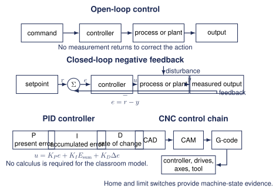

# Control Systems and CNC {.course-day-slide}

Electronics, programming, Linux, motion, and fabrication

# C01 Control-System Anatomy

{width=96%}

## Core Quantities

$$e=r-y$$

| Symbol | Meaning |
|:--:|:--|
| $r$ | setpoint |
| $y$ | measured output |
| $e$ | error |
| $u$ | controller output |

Name one disturbance for a thermostat, cruise control, or motor drive.

# C02 Open-Loop Control

The controller does not measure the result.

- timed motor operation
- fixed PWM
- simple conveyor timing
- stepper motion without position feedback

## Open-Loop Disturbance

A motor receives a fixed $60\%$ command. Load increases halfway through the run.

Predict the speed graph.

::: {.fragment}
The command remains fixed while actual speed can fall.
:::

# C03 Closed-Loop Feedback

The sensor returns measured output. Negative feedback applies a correcting action intended to reduce error.

For $r=24.0^\circ\mathrm{C}$ and $y=21.5^\circ\mathrm{C}$:

$$e=+2.5^\circ\mathrm{C}$$

## Response Evidence

Plot setpoint and measured output on the same time axis.

Identify only what the data show:

- rise time
- overshoot
- steady-state error
- cycling
- disturbance recovery

# C04 On-Off Control

Full output below the threshold. Zero output above the threshold.

A single threshold can cause rapid switching when noise or lag moves the measurement around the setpoint.

## Hysteresis

For heating with setpoint $r$ and half-band $h$:

- turn on below $r-h$
- turn off above $r+h$
- keep the previous state inside the band

Wider hysteresis usually reduces switching and increases the allowed output range.

# C05 Proportional Control

$$u=K_Pe$$

Higher gain can improve response speed and reduce final error. Excessive gain can cause overshoot or oscillation.

## Gain Comparison

| Gain | Rise time | Overshoot | Final error | Stability |
|--:|--:|--:|--:|:--|
| low | | | | |
| medium | | | | |
| high | | | | |

Choose a gain using evidence from the graph.

# C06 Integral Action

Integral action responds to accumulated error. It can remove steady-state error.

If the output saturates while error keeps accumulating, integral windup can produce a large delayed correction.

Limit or pause integral accumulation during saturation.

## Derivative Action

Derivative action responds to how quickly error changes. It can reduce overshoot when measurements are sufficiently clean.

Noise can produce large derivative changes. Filtering and careful measurement matter.

## PID Classroom Model

$$u_k=K_Pe_k+K_I\sum e\Delta t+K_D\frac{e_k-e_{k-1}}{\Delta t}$$

The sampled form supports spreadsheet simulation without calculus.

## P, PI, PD, and PID

| Mode | Main benefit | Main limitation |
|:--|:--|:--|
| P | simple correction | final error can remain |
| PI | removes persistent error | windup and overshoot |
| PD | anticipates rapid change | noise sensitivity |
| PID | combines the actions | more tuning and safeguards |

## Manual Tuning Investigation

1. Start with every gain at zero.
2. Increase $K_P$ until the response is useful.
3. Add a small $K_I$ to remove remaining error.
4. Add $K_D$ only when the data support it.
5. Compare graphs after every change.

Tune in simulation before physical implementation.

# C07 State Machines

| State | Outputs | Transition |
|:--|:--|:--|
| idle | motor off | start and guards safe |
| run | motor active | stop, limit, or timer done |
| complete | indicator on | reset |
| fault | outputs safe | fault cleared and reset approved |

Every state needs defined stop and fault behaviour.

# C08 Safety Controls

- normally closed stop circuits
- emergency-stop principles
- guard and door interlocks
- limit switches
- fault and reset states
- fail-safe design

::: {.important}
Classroom models do not replace certified industrial safety systems.
:::

# C09 Motor and Motion Control

| System | Command | Feedback |
|:--|:--|:--|
| DC motor | direction and PWM | encoder or speed sensor |
| H-bridge | direction and PWM | current, speed, or position |
| servo | command pulse | internal position feedback |
| stepper | step and direction | optional encoder |

## Driver Requirements

Check:

- supply voltage
- running and stall current
- switching and thermal limits
- flyback or recirculation path
- direction logic
- stop behaviour

GPIO pins do not drive motors directly.

# C10 CNC as a Control System

| Layer | Role |
|:--|:--|
| CAD | geometry |
| CAM | toolpaths |
| G-code | motion and machine functions |
| controller | coordinated motion |
| drives and motors | axis movement |
| machine process | finished part |

## Open-Loop and Closed-Loop CNC

Open-loop stepper systems assume commanded steps produced motion.

Closed-loop servo systems measure motion and correct error.

Both need homing, limits, interlocks, and a suitable emergency-stop strategy.

## LinuxCNC

LinuxCNC provides:

- G-code interpretation
- real-time motion control
- hardware connections through HAL
- open-loop stepper support
- closed-loop servo support
- simulation before supervised machine testing

# C11 Culminating Project

Choose a thermostat, motor-speed system, servo position system, stepper axis, state machine, logic game, miniature conveyor, CNC subsystem model, or supervised LinuxCNC test.

## Required Engineering Evidence

1. Block diagram and expected response
2. Sample data or simulation
3. Setpoint and measured-output graph
4. Relevant response features
5. One design change with evidence
6. Fault, limit, and safe-state analysis
7. Engineering conclusion

## Control-Method Comparison

Use the same process to compare:

- open loop
- on-off
- on-off with hysteresis
- proportional
- PI or PID

The differences should be visible in the graphs.

# Downloads and Shared Resources

- [Control Systems and CNC notes](https://andrewandrade.ca/commons/tej3-4/05-control-systems/)
- [PID comparison activity](https://mrandrewandrade.github.io/assets/C06_Control_Methods_Comparison_Student.pdf)
- [Reference handbook](https://mrandrewandrade.github.io/assets/TEJ-Electronics-Reference-Handbook.html)
- [Shared fabrication resources](https://andrewandrade.ca/commons/teaching-materials/)

# Exit Check

Compare open loop, hysteresis, proportional, and PID control for one process.

Name the evidence that supports each claim.
