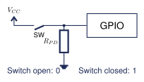
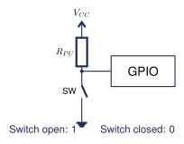
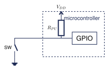
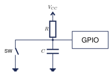
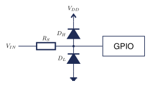
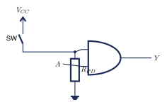

# D01 Digital Inputs {.course-day-slide}

Stable switch circuits before microcontrollers

::: {.big-prompt}
A GPIO pin measures voltage. The circuit must define that voltage.
:::

# Digital Voltage Levels

| Input voltage | Interpretation |
|:--|:--|
| below $V_{IL(\max)}$ | guaranteed low |
| between thresholds | not guaranteed |
| above $V_{IH(\min)}$ | guaranteed high within device limits |

The exact thresholds belong to the exact device.

## 3.3 V and 5 V Compatibility

- Identify the receiving GPIO voltage.
- Check high and low thresholds.
- Check the absolute maximum pin voltage.
- Check the source while the receiver is unpowered.
- Use an approved interface when domains differ.

::: {.important}
A 5 V power pin does not make nearby GPIO inputs 5 V tolerant.
:::

# Floating Inputs

{width=86%}

Noise, leakage, static charge, and nearby signals can change the reading.

## Prediction Check

A switch connects a GPIO input to $V_{CC}$ when pressed.

What does the pin read while the switch is open?

::: {.fragment}
**Undefined.** The switch does not establish the open-state voltage.
:::

# External Pull-Down

{width=86%}

| Switch | Voltage | Logic |
|:--|:--:|:--:|
| open | about $0\ \mathrm{V}$ | 0 |
| closed | about $V_{CC}$ | 1 |

The pressed state is active-high.

# External Pull-Up

{width=86%}

| Switch | Voltage | Logic |
|:--|:--:|:--:|
| open | about $V_{CC}$ | 1 |
| pressed | about $0\ \mathrm{V}$ | 0 |

The pressed state is active-low.

## The Resistor Prevents a Short

With a pull-up, closing the switch creates a current path through the resistor:

$$I=\frac{V_{CC}}{R_{PU}}$$

For $5.0\ \mathrm{V}$ and $10\ \mathrm{k}\Omega$:

$$I=0.50\ \mathrm{mA}$$

Without the resistor, the switch would connect the supply directly to ground.

# Active-Low Logic

Pressed produces logic 0.

Common names:

- $\overline{\mathrm{BUTTON}}$
- `/BUTTON`
- `BUTTON_N`

State the convention. Do not rely on colour alone.

# Internal Pull-Ups

{width=88%}

```cpp
pinMode(buttonPin, INPUT_PULLUP);
bool pressed = digitalRead(buttonPin) == LOW;
```

## When an External Resistor Still Helps

- a stronger or known bias is required
- wiring is long or electrically noisy
- the state must remain defined during reset
- the interface uses another voltage domain
- an RC network needs a selected resistance

Confirm the processor data before choosing a value.

# Contact Bounce

One physical press can produce several rapid electrical transitions.

Debounce options:

- timed software state machine
- RC network with a suitable threshold input
- dedicated debounce circuit

## RC Hardware Debounce

{width=86%}

$$\tau=RC$$

A calculated time constant is a starting point. Verify the actual waveform and input thresholds.

# Input Protection

{width=86%}

Protection can limit abnormal current. It does not make every source voltage compatible.

## Compatibility Evidence

Before connection, record:

- source high and low voltage
- receiving thresholds
- absolute maximum pin voltage
- allowed clamp current
- source state during power-up and power-down
- wire length and electrical environment

# Logic-Gate Input

{width=88%}

The same stable-input rules apply before a switch reaches a gate or microcontroller.

# Circuits Culminating Project

Build a low-voltage logic system with:

- stable switch inputs
- a complete truth table
- at least two logic functions
- current-limited indicators
- an output driver when the load requires one
- one safe troubleshooting fault

# Evidence Cycle

1. Predict
2. Calculate using GUESS
3. Draw the schematic
4. Simulate or verify
5. Build or test
6. Compare evidence
7. Diagnose a fault or limitation
8. Explain and reflect

# Downloads

- [D01 notes](https://andrewandrade.ca/commons/tej3-4/03-digital-logic-inputs/)
- [D01 student worksheet](https://mrandrewandrade.github.io/assets/D01_Digital_Inputs_Student_Worksheet.pdf)
- [Electronics reference handbook](https://mrandrewandrade.github.io/assets/TEJ-Electronics-Reference-Handbook.html)

# Exit Check

Explain these three ideas without notes:

1. why a floating input is invalid
2. why a pull-up switch is active-low
3. why 5 V logic cannot be assumed safe for a 3.3 V GPIO
