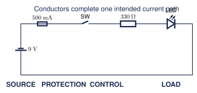

# H01 · Safety and Lab Practice {.course-day-slide}

Protected low-voltage circuits

::: {.big-prompt}
Calculate first. Simulate second. Build third.
:::

# Today's Route {.route-slide}

1. Real objects
2. Internal view
3. Functional blocks
4. Proper schematic
5. Component roles
6. GUESS and Casio
7. Tinkercad
8. Physical build
9. Troubleshooting
10. Reflection

# Real Object · USB Power Bank

- **Source:** cells and regulated output
- **Conductors:** PCB traces, cable, connector contacts
- **Control:** power-management electronics and button
- **Protection:** current, voltage, temperature, and cell controls
- **Load:** phone, light, or another USB device

::: {.big-prompt}
The label is a boundary, not a challenge.
:::

# Real Object · Vehicle Fuse Panel

- The battery can supply dangerous fault current.
- A branch fuse is placed near the source.
- The fuse protects the branch conductor and circuit.
- A blown fuse is evidence. Find the fault before replacement.

::: {.small-note}
Use a classroom model. Do not work on a live vehicle circuit during this lesson.
:::

# Inside a Blade Fuse

::: {.fuse-cutaway role="img" aria-label="Simplified blade fuse cutaway with two terminals joined by a narrow calibrated element"}

blade

calibrated element

blade

:::

Excess current produces heating. The narrow element melts and opens the path.

# Functional Block Diagram

::: {.block-flow role="img" aria-label="Source feeds protection, control, and load through conductors"}
Source<b>→</b>Protection<b>→</b>Control<b>→</b>Load
:::

Conductors join every block. Protection belongs close to the source.

# Proper Schematic

{width=96%}

# Stop Conditions

- heat, smell, smoke, or damaged insulation
- unexpected current or unstable connection
- metal object dropped near energized conductors
- meter lead in the wrong jack
- uncertainty about the circuit or procedure

::: {.big-prompt}
Disconnect first. Explain second.
:::

# Component Roles

| Part | Role | Check before power |
|:--|:--|:--|
| source | provides potential difference | voltage and current limit |
| fuse | interrupts excessive current | rating and placement |
| switch | controls the intended path | open before power |
| resistor | limits LED current | value and power rating |
| LED | converts energy to light | polarity and rating |

# Predict Before Calculating

A $9.0\ \mathrm{V}$ source supplies a red LED with $V_F=2.0\ \mathrm{V}$ through $330\ \Omega$.

::: {.big-prompt}
Will the current be closer to $2\ \mathrm{mA}$, $20\ \mathrm{mA}$, or $200\ \mathrm{mA}$?
:::

# GUESS · Given and Unknown

**Given**

| Symbol | Value |
|:--:|--:|
| $V_S$ | $9.0\ \mathrm{V}$ |
| $V_F$ | $2.0\ \mathrm{V}$ |
| $R$ | $330\ \Omega$ |

**Unknown:** $I$ and $P_R$

# GUESS · Equations

$$V_R=V_S-V_F$$

$$I=\frac{V_R}{R}$$

$$P_R=I^2R$$

Write the general equation before inserting numbers.

# GUESS · Substitute and Solve

$$I=\frac{9.0\ \mathrm{V}-2.0\ \mathrm{V}}{330\ \Omega}=0.021212\ldots\ \mathrm{A}$$

$$I=21\ \mathrm{mA}$$

$$P_R=(0.021212\ldots\ \mathrm{A})^2(330\ \Omega)=0.15\ \mathrm{W}$$

# Casio fx-991ES PLUS C

1. `MODE` `1` (`COMP`)
2. `( 9.0 - 2.0 ) ÷ 330 =`
3. Display: `0.021212121...`
4. Reuse Ans: `Ans x² × 330 =`
5. Display: `0.148760330...`

::: {.big-prompt}
Keep Ans. Round only the final result.
:::

# GUESS · Statement

The estimated LED current is **$21\ \mathrm{mA}$** and the resistor dissipates **$0.15\ \mathrm{W}$**.

A $0.25\ \mathrm{W}$ resistor exceeds the calculated dissipation, but the LED current and actual component data still require checking.

# In-Class Check

Which change reduces LED current?

1. Increase $V_S$
2. Decrease $R$
3. Increase $R$
4. Bypass the fuse

::: {.fragment}
**Answer: 3.** From $I=(V_S-V_F)/R$, increasing $R$ reduces current.
:::

# Tinkercad · Build

1. Add the source, switch, resistor, and LED.
2. Confirm values and LED polarity.
3. Keep the switch open.
4. Place the ammeter in series.
5. Place voltmeters in parallel.
6. Start the simulation, then close the switch.

# Tinkercad · Compare

| Quantity | Calculated | Simulated | Percent difference |
|:--|--:|--:|--:|
| LED current | $21.21\ \mathrm{mA}$ | | |
| Resistor voltage | $7.0\ \mathrm{V}$ | | |
| LED voltage | $2.0\ \mathrm{V}$ | | |

$$\%\text{ difference}=\frac{|x_s-x_c|}{|x_c|}\times100\%$$

# Simulation Has Limits

- idealized conductors
- simplified LED and fuse behaviour
- fixed or simplified temperature
- no damaged leads, wrong jacks, loose metal, or real arcing

::: {.big-prompt}
Tinkercad verifies reasoning. It does not certify physical safety.
:::

# Physical Build · Pre-Power Check {.two-column-list}

- source disconnected
- switch open
- current limit set
- fuse present near the source
- resistor value confirmed
- LED polarity confirmed
- no exposed conductor can short
- meter jack, function, range, and placement checked
- partner trace completed
- teacher approval received

# Measure Correctly

**Voltmeter:** parallel across two points. 
**Ammeter:** open the path and insert it in series. 
**Ohmmeter:** power off, stored energy discharged, component isolated as needed.

::: {.important}
Never place a current-configured meter directly across a source.
:::
# Troubleshooting · Open Switch

Predict before measuring:

- total current: $0\ \mathrm{A}$
- voltage across resistor: $0\ \mathrm{V}$
- voltage across open switch: approximately $9.0\ \mathrm{V}$

Why can voltage exist where current is zero?

# Safe Diagnostic Sequence {.two-column-list}

1. Observe the symptom.
2. Inspect the setup.
3. Verify source voltage in parallel.
4. Trace voltage toward the load.
5. Disconnect power.
6. Discharge stored energy.
7. Use continuity or resistance mode.

# Reflection

- Which check prevented the most likely error?
- What evidence separated an open switch from a dead source?
- What did Tinkercad omit?
- What will you change before the next build?

# Downloads and Notes

- [H01 module page](https://andrewandrade.ca/commons/tej3-4/electronics-library/modules/h01-safety-lab-practice.html)
- [Two-page quick reference](https://mrandrewandrade.github.io/assets/TEJ-Electronics-Quick-Reference.pdf)
- [Electronics reference handbook](https://mrandrewandrade.github.io/assets/TEJ-Electronics-Reference-Handbook.html)
- [Student worksheet](https://mrandrewandrade.github.io/assets/H01_Safety_Lab_Practice_Student_Worksheet.pdf)
- [Lab handout](https://mrandrewandrade.github.io/assets/H01_Safety_Lab_Practice_Lab.pdf)
- [Tinkercad guide](https://mrandrewandrade.github.io/assets/H01_Safety_Lab_Practice_Tinkercad_Guide.pdf)

Teacher keys and licensed textbook references remain restricted.

# Exit Check

Before leaving:

1. Return the meter lead from the current jack.
2. Disconnect the source.
3. Store components and leads.
4. Submit calculation, comparison, evidence, and reflection.

::: {.big-prompt}
Safe work is deliberate work.
:::
